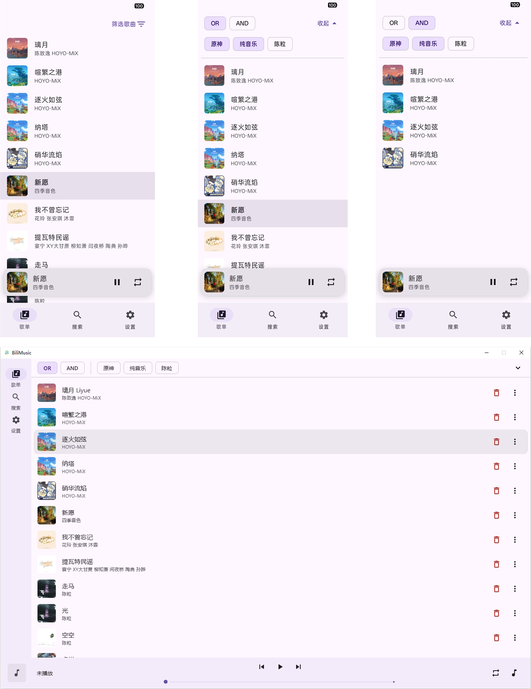

# BiliMusic KMP

使用 Kotlin Multiplatform 开发的，以 BiliBili、酷狗音乐、网易云音乐 为音频源的音乐播放器。支持Android、Windows。



## 依赖

Windows端的音乐播放依赖于VLC，所以需要在默认路径安装[VLC media player](https://www.videolan.org/vlc/)

## 功能

- [x] 媒体搜索

  除常规搜索外，还支持直接输入ID（B站：bv_id；网易云：song_id）、URL（原链接、短链接（可含其他文字））

- [x] 音乐播放

- [x] LLM提取歌曲信息（需符合OpenAI接口）：歌曲名称、歌手

  非常建议使用！便于从网易云获取歌曲ID、歌词、封面

  免费的大模型API：

  * [智谱GLM（链接含邀请码）](https://www.bigmodel.cn/login?icode=Pe+h7w7M3Gx9gG4r3CNzLEjPr3uHog9F4g5tjuOUqno=&from=invite&redirect=/)的glm-4.7-flash

  * [GPT_API_free](https://github.com/chatanywhere/GPT_API_free)

- [x] 歌词、封面

  从网易云音乐获取歌词、封面

- [x] Tag

  可以为每一首歌曲添加Tag，替代了歌单功能
  
- [x] 云同步（待优化）

  需要使用JS编写脚本，实现2个函数：

  ```javascript
  function upload(filename, data)
  
  function download(filename)
  ```

  js runtime、编写调试工具：[JSK](https://github.com/ZuoguanPikachu/JSK)